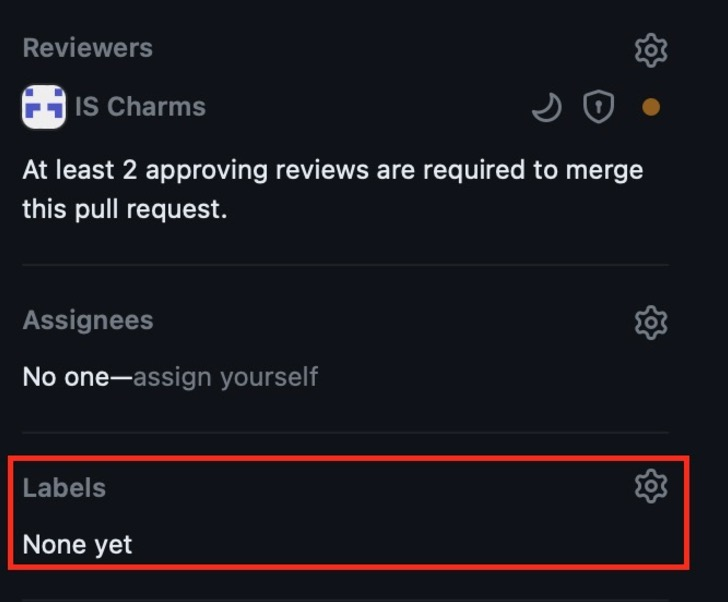

Pull Requests
=============

.. toctree::
   :maxdepth: 2

The following sections discuss practices that should be followed when delivering
stories.

Define the public interface
~~~~~~~~~~~~~~~~~~~~~~~~~~~

Stories that are anticipated to be marked as requiring senior review (see below)
have a two stage development process. The first stage is the public interface
and configuration design. This should be completed as a part of writing a spec
for the change which should include a link to a WIP PR with the public interface
design. Any stories that don't have a spec or already have an approved spec
without a public interface design also require the WIP PR as a first step.

Only after this should implementation proceed. Note that implementation may
start on the same branch as soon as any draft PR is raised and doesn’t have to
wait for review comments.

Specifically, the WIP PR should include:

* Any changes, additions or deletions of the public interfaces (including
  docstrings) of any of the modules in the source code (note that, at this
  stage, tests and linting won’t pass due to the missing implementation)
* Any changes, additions or deletions of juju events being handled
* Any changes, additions or deletions of configuration options and actions
  (by modifying ``config.yaml`` and ``actions.yaml`` or ``charmcraft.yaml``)
* Any changes to provides and requires by modifying ``charmcraft.yaml``

In regards to the public interfaces, consider the following public function in a
module:

.. code-block:: python

    def wait_ready(timeout: int = 300, check_interval: int = 10) -> None:
        """Wait until Jenkins service is up.

        Args:
            timeout: Time in seconds to wait for jenkins to become ready in 10
                second intervals.
            check_interval: Time in seconds to wait between ready checks.

        Raises:
            TimeoutError: if Jenkins status check did not pass within the
                timeout duration.
        """
        try:
            _wait_for(_is_ready, timeout=timeout, check_interval=check_interval)
        except TimeoutError as exc:
            raise TimeoutError(
                "Timed out waiting for Jenkins to become ready."
            ) from exc

For the purpose of the WIP PR, only the function signature and docstring should
be included:

.. code-block:: python

    def wait_ready(timeout: int = 300, check_interval: int = 10) -> None:
        """Wait until Jenkins service is up.

        Args:
            timeout: Time in seconds to wait for jenkins to become ready in 10
                second intervals.
            check_interval: Time in seconds to wait between ready checks.

        Raises:
            TimeoutError: if Jenkins status check did not pass within the
                timeout duration.
        """

If, for example, a new argument is required to be added in the PR, just the
function signature and docstring should initially be updated for raising the WIP
PR:

.. code-block:: python

    def wait_ready(
        timeout: int = 300,
        check_interval: int = 10,
        use_exp_backoff: bool = False,
    ) -> None:
        """Wait until Jenkins service is up.

        Args:
            timeout: Time in seconds to wait for jenkins to become ready in 10
                second intervals.
            check_interval: Time in seconds to wait between ready checks.
            use_exp_backoff: Whether exponential backoff should be used to wait
                for Jenkins to be ready.

        Raises:
            TimeoutError: if Jenkins status check did not pass within the
                timeout duration.
        """

Similarly, for classes, any public attributes (including their type) and
functions (including their signature and docstring) are in scope. It is likely
that during the implementation the public interface may change. The WIP PR
should represent the best view before implementation of what will be required.

The design review can be done in the following ways:

* A draft PR review from a senior team member
* Meeting with a senior to go over the draft PR
* Take the draft PR to the architecture office hours
* Have the design approved as a part of as spec
* Pair program with a senior on the interface design

Once completed, the person doing the senior review should leave a comment on the
WIP PR approving the public interface.

PR complexity and senior review requirement
~~~~~~~~~~~~~~~~~~~~~~~~~~~~~~~~~~~~~~~~~~~

PRs should be as small as they can pragmatically be. For example, if it includes
multiple features it should be split into multiple PRs.

PRs raised by developers should be tagged according to the following labels to
help indicate the complexity of the review:

* ``trivial``: minor bug fix, documentation updates, making changes based on the
  pre-reviewed code, adding a minor test case, refactoring a small code segment
* ``senior-review-required``: anything else, such as, architecture change, new
  feature introduced, new charm, refactor

PRs in GitHub can be labelled in the following way below the reviewers section:

PRs with documentation
~~~~~~~~~~~~~~~~~~~~~~

Once documentation has been written for a project, PRs that make a change to a
feature, introduce a new feature or otherwise make significant changes that our
user should know about should include documentation in the PR.

If there is documentation in the PR, it should be tagged with documentation to
indicate to the technical author in the team that they should review the PR. Do
not tag PRs with trivial changes in docs like typos, small fixes or deleting
documentation when a feature is dropped.

PR reviews
~~~~~~~~~~

Anyone on the team can review trivial PRs and PRs generated by automation such
as bumps to library or dependency versions. These PRs should be skipped by
senior team members to help them focus on the PRs requiring their review. PRs
marked as requiring senior review should be reviewed by at least one senior team
member, such as an architect, manager, senior developer (see Canonical levelling
framework) or as identified by management. PRs with this tag should not be
merged until the senior reviewer has approved the PR, even if 2 other people
have already approved the PR.

The
`IS & IS DevOps Roadmap planning <https://docs.google.com/spreadsheets/d/1iSkut6Qf_mm7_HynYeCX_lB47noCGJuXNe1ODrbXTPk/edit?usp=sharing>`_
spreadsheet identifies who should be doing the senior review and the second
review for each roadmap item. When raising a PR, please request review from
those people. In the case of trivial PRs, a second review can be requested from
anyone on the team.

PR description
~~~~~~~~~~~~~~

Unless the PR is trivial or self-explanatory (for example, fixing typos in the
documentation, a well known task that needs to be done across many repositories
such as enabling a new bot), the PR description should include:

* A high level overview of the change
* The reason the change is needed
* Any applicable spec if relevant and it is publicly available
* Any changes to the juju events being observed (newly added, significantly
  modified or deleted)
* Any high level changes to modules and why (Service, Observer, helper)
* Any changes to charm libraries
* Either
    * A confirmation that
        * The `charm style guide <https://juju.is/docs/sdk/styleguide>`_ was applied
        * The
          `contributing guide <https://github.com/canonical/is-charms-contributing-guide>`_
          was applied
        * The changes are compliant with
          `ISD014 - Managing Charm Complexity <https://docs.google.com/document/d/1G62PosrObvmQY5KbxvqaxByojlhDxrmNtcbPS39YbaY/edit?usp=sharing>`_
    * Or which of the standards/ guidelines was not applied and why

The above should be created as a template for raising PRs across all of our
repositories:

.. code-block:: markdown

    Applicable spec: <link>

    ### Overview

    <A high level overview of the change>

    ### Rationale

    <The reason the change is needed>

    ## Juju Events Changes

    <Any changes to the juju events being observed (newly added, significantly modified or deleted)>

    ### Module Changes

    <Any high level changes to modules and why (Service, Observer, helper)>

    ### Library Changes

    <Any changes to charm libraries>

    ### Checklist

    - [ ] The [charm style guide](https://juju.is/docs/sdk/styleguide) was applied
    - [ ] The [contributing guide](https://github.com/canonical/is-charms-contributing-guide) was applied
    - [ ] The changes are compliant with [ISD054 - Manging Charm Complexity](https://discourse.charmhub.io/t/specification-isd014-managing-charm-complexity/11619)
    - [ ] The documentation is generated using `src-docs`
    - [ ] The documentation for charmhub is updated.
    - [ ] The PR is tagged with appropriate label (`trivial`, `require-senior-review`, `documentation`)

    <Explanation for any unchecked items above>
