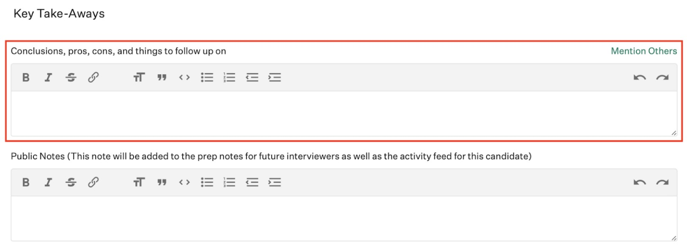
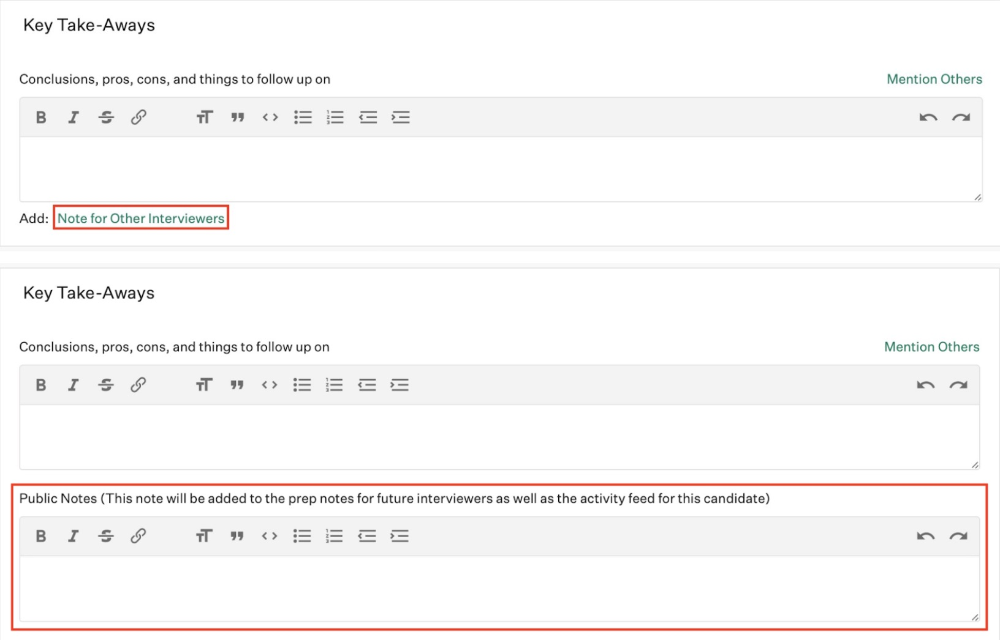

.. _coding-take-home-exercise-review:

Coding take home exrercise review
=================================

First a note on statistics. We receive many coding exercise submissions and
relatively few of them are good. After a few of the early stages, reviewing the
take home exercise is where many candidates exit the hiring process. Don’t be
disheartened if many of the coding exercises are poor. The reason we have the
stage is to help make sure the people we hire are great coders!

Reviewing the take home exercise is similar to reviewing a PR. Both individual
lines of code and holistic considerations should be evaluated. The following
document sets out guidance for reviewing the take home exercise, including the
kinds of issues to look for:
`06 - DevOps Eng / Associate Software Eng / COE - Expectations from Take-home test <https://docs.google.com/document/d/1vW-WJEvE1XcOpdliyfFKXQVywCCVVKNmX9A95b6E5_A/edit?usp=sharing>`_

Common Issues
-------------

The team has commonly found the following issues which are worth highlighting if
found in a submission in addition to anything else that stands out. Note that
the presence of these does not automatically disqualify a candidate, they do
warrant further discussion in later stages of the hiring process. If  submission
has many of these, it is usually not worth progressing the candidate further.
The following list is split into stylistic and functional issues. The following
are some notes to help weigh each of the issues, they are general in nature and
judgment needs to be used for each review:

* Functional issues are generally more severe than stylistic issues. A solution
  that doesn’t work or has misinterpreted the requirements with great style is
  generally worse than a solution that implements all the requirements and is in
  working order with some style issues. If there is a functional issue the
  review can be stopped at that time and a No scorecard can be submitted. Even
  when you submit a No scorecard, please add details on why and any
  considerations/limitations you would like to be explored further for the
  candidate.
* When reviewing the code, consider the kind of feedback the candidate may get
  if this code landed as a PR for the team to review on one of our repositories.
  If we hired them, they would need to be able to get code through our PR
  process.
* The follow up questions on the code are intended to help the coding
  interviewer in the next stage learn more about how the candidate codes. It is
  worth adding a question if you are unsure about a line of code or a follow up
  question might lead to an interesting conversation with the candidate that
  helps us understand them better.
* A few stylistic issues are probably going to be ok, if the code has many
  stylistic issues or some of the more severe issues, it might be better not to
  progress with the candidate.

Make a copy of the Coding
`Take Home Exercise Checklist Template <https://docs.google.com/document/d/1srdyO-ccNNqHS9I8rhjUPhd8jlhn150gnn1T_sQz2QA/edit?usp=sharing>`_
and check each of the checkboxes that apply for the candidate.

Writing the Scorecard
---------------------

Be sure to rate the focus attributes. The scorecard has two free-form fields.
One is a private field only visible to the hiring lead and a few others. The
public field is visible to all those involved in the hiring process for the
candidate. The following sections describe what should be included in the
private and public fields.

Note that the candidate can request access to the content of the scorecard and
any other information we hold on the candidate. Please make sure that the
content in the scorecard and any other information you retain about the
candidate can be shared with the candidate. An example would be to avoid
disclosing any Canonical confidential information.

Did the candidate pass the interview?
~~~~~~~~~~~~~~~~~~~~~~~~~~~~~~~~~~~~~

The expectations vary by experience of the candidate. Since the take home
exercise review is anonymous, you will not know how much experience the
candidate has. Instead, use the following guidance below and indicate for which
level the recommendation is.

* Any functional issues are not acceptance at any level
* Senior: no severe stylistic issues
* Mid: one or two severe stylistic issues at most
* Junior: some severe stylistic issues are acceptable

For example, if there is one stylistic issue, the rating should be yes and the
private field should include “recommended level: mid”. The hiring lead will
compare the actual experience of the candidate with the recommendation and make
a decision whether to move forward with the candidate.

Private Field
~~~~~~~~~~~~~

Include your final judgment of whether the hiring process for the candidate
should proceed for the specific role, including a recommendation for the level
(senior, mid, junior). If you believe the candidate would be a better fit for
another kind of role, highlight that as well. Include reasons for your judgment
including evidence from the submitted code.

Copy the summary from the
`Take Home Exercise Checklist Template <https://docs.google.com/document/d/1srdyO-ccNNqHS9I8rhjUPhd8jlhn150gnn1T_sQz2QA/edit?usp=sharing>`_
for the candidate (the number of functional and severe and informational
stylistic issues) into the scorecard and include a link to the full checklist
for the submission.

Public Field
~~~~~~~~~~~~

Include the line by line feedback of any issues you have found here. Be sure to
include the file name and line number. These will be used as follow up
conversations in later stages of the hiring process. Also include an indication
of the kind of question you would ask to inquire further about the issue.

For example:

* main.py
   * l80: use of sys.argv, why not use argparse?
   * l20: reading the entire file into memory, what are the trade-offs?
   * ...
* ...
